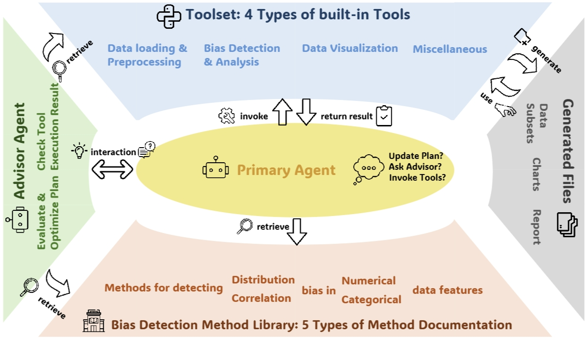
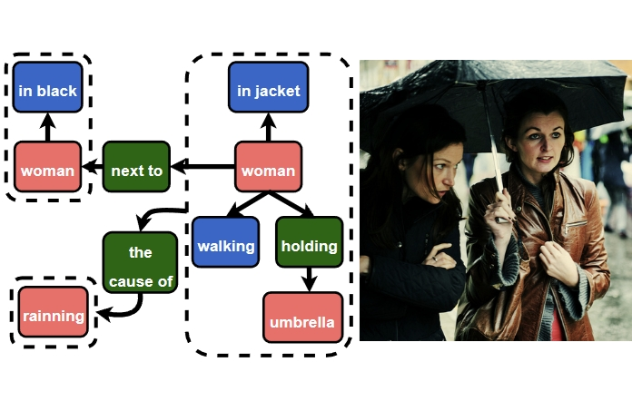
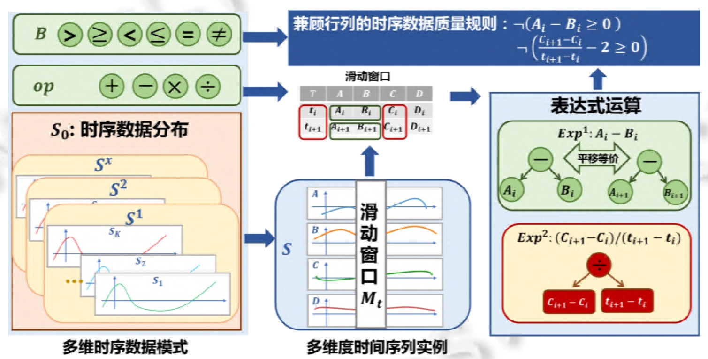
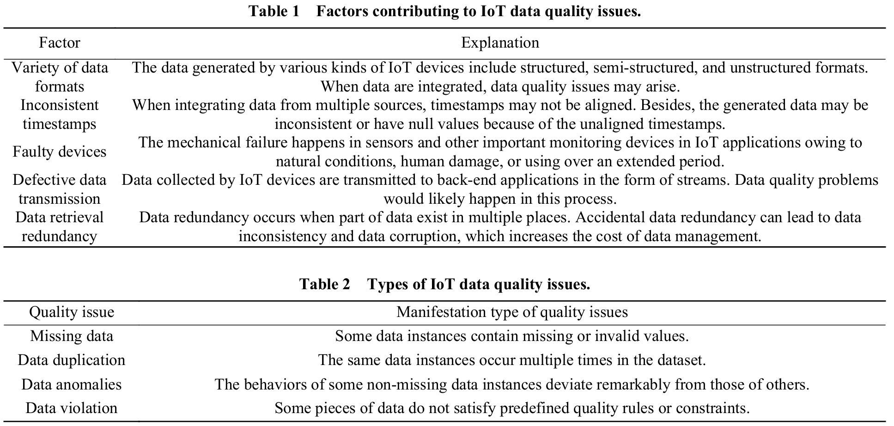

I am a second-year Master student at the [University of Southern California](https://www.usc.edu/), advised by Prof. [Jieyu Zhao](https://jyzhao.net/) in the [LIME Lab](https://jyzhao.net/lab.html). Previously, I earned my Bachelor's degree at [Harbin Institute of Technology](https://www.hit.edu.cn/)(HIT) and worked as a Research Assistant in [HIT Massive Data Computing Lab](https://db.hit.edu.cn/main.htm) under the guidance of Prof. [Hongzhi Wang](https://homepage.hit.edu.cn/wang) and [Xiaoou Ding](https://scholar.google.com/citations?user=GJUuXGMAAAAJ).

My research focuses on Natural Language Processing, with a highly interested in the intersection with NLP x {Engineering, Finance, Biology, etc.}. Recently, my research  has devoted significant attention to building trustworthy NLP models, as well as developing and applying Large Language Model Agents and Vision-Language Models to reduce bias and protect privacy.

News
======
*07/2024* : I joined [LIME Lab](https://jyzhao.net/lab.html) at [USC](https://www.usc.edu/) as a research assistant, under the supervision of Professor [Jieyu Zhao](https://jyzhao.net/).

Publications

* indicates equal contribution.

======
<table style="border: none; border-collapse: collapse; width: 100%; table-layout: fixed; margin-bottom: 20px;">
  <tr>
    <td style="border: none; width: 180px; vertical-align: top; padding-right: 20px;">
      
    </td>
    <td style="border: none; vertical-align: top;">
      BIASINSPECTOR: Detecting Bias in Structured Data through LLM Agents  
      <a href="https://arxiv.org/pdf/2504.04855">[PDF]</a> 
      <a href="https://arxiv.org/abs/2504.04855">[PROJECT PAGE]</a> 
      <a href="https://github.com/uscnlp-lime/BiasInspector">[CODE]</a>  
      <strong>Haoxuan Li</strong>, Mingyu Derek Ma, Jen-tse Huang, Zhaotian Weng, Wei Wang, Jieyu Zhao   
      <i>arXiv preprint</i>  
    </td>
  </tr>
</table>
<table style="border: none; border-collapse: collapse; width: 100%; table-layout: fixed; margin-bottom: 20px;">
  <tr>
    <td style="border: none; width: 180px; vertical-align: top; padding-right: 20px;">
      
    </td>
    <td style="border: none; vertical-align: top;">
      What’s Missing in Vision-Language Models? Probing Their Struggles with Causal Reasoning  
      <!-- <a href="https://jos.org.cn/jos/article/pdf/6793">[PDF]</a> 
      <a href="https://jos.org.cn/jos/article/abstract/6793">[PROJECT PAGE]</a>   -->
      [PDF coming soon] 
      [Project page coming soon]  
      Zhaotian Weng, <strong>Haoxuan Li</strong>, Kuan-Hao Huang, Jieyu Zhao  
      <i>Under peer review</i>  
    </td>
  </tr>
</table>
<table style="border: none; border-collapse: collapse; width: 100%; table-layout: fixed; margin-bottom: 20px;">
  <tr>
    <td style="border: none; width: 180px; vertical-align: top; padding-right: 20px;">
      
    </td>
    <td style="border: none; vertical-align: top;">
      Time Series Data Quality Rules Discovery with Both Row and Column Dependencies  
      <a href="https://jos.org.cn/jos/article/pdf/6793">[PDF]</a> 
      <a href="https://jos.org.cn/jos/article/abstract/6793">[PROJECT PAGE]</a>  
      Xiaoou Ding, Yingze Li, Chen Wang, Hongzhi Wang, <strong>Haoxuan Li</strong>  
      <i>Journal of Software (2023)</i>  
    </td>
  </tr>
</table>
<table style="border: none; border-collapse: collapse; width: 100%; table-layout: fixed; margin-bottom: 20px;">
  <tr>
    <td style="border: none; width: 180px; vertical-align: top; padding-right: 20px;">
      
    </td>
    <td style="border: none; vertical-align: top;">
      IoT data cleaning techniques: A survey  
      <a href="https://ieeexplore.ieee.org/stamp/stamp.jsp?tp=&arnumber=10026521">[PDF]</a> 
      <a href="https://ieeexplore.ieee.org/document/10026521">[PROJECT PAGE]</a>  
      Xiaoou Ding, Hongzhi Wang, Genglong Li, <strong>Haoxuan Li</strong>, Yingze Li, Yida Liu  
      <i>Intelligent and Converged Networks (2022)</i>  
    </td>
  </tr>
</table>

<!-- Getting started
======
1. Register a GitHub account if you don't have one and confirm your e-mail (required!)
2. Fork [this repository](https://github.com/academicpages/academicpages.github.io) by clicking the "fork" button in the top right. 
3. Go to the repository's settings (rightmost item in the tabs that start with "Code", should be below "Unwatch"). Rename the repository "[your GitHub username].github.io", which will also be your website's URL.
4. Set site-wide configuration and create content & metadata (see below -- also see [this set of diffs](http://archive.is/3TPas) showing what files were changed to set up [an example site](https://getorg-testacct.github.io) for a user with the username "getorg-testacct")
5. Upload any files (like PDFs, .zip files, etc.) to the files/ directory. They will appear at https://[your GitHub username].github.io/files/example.pdf.  
6. Check status by going to the repository settings, in the "GitHub pages" section

Site-wide configuration
------
The main configuration file for the site is in the base directory in [_config.yml](https://github.com/academicpages/academicpages.github.io/blob/master/_config.yml), which defines the content in the sidebars and other site-wide features. You will need to replace the default variables with ones about yourself and your site's github repository. The configuration file for the top menu is in [_data/navigation.yml](https://github.com/academicpages/academicpages.github.io/blob/master/_data/navigation.yml). For example, if you don't have a portfolio or blog posts, you can remove those items from that navigation.yml file to remove them from the header. 

Create content & metadata
------
For site content, there is one markdown file for each type of content, which are stored in directories like _publications, _talks, _posts, _teaching, or _pages. For example, each talk is a markdown file in the [_talks directory](https://github.com/academicpages/academicpages.github.io/tree/master/_talks). At the top of each markdown file is structured data in YAML about the talk, which the theme will parse to do lots of cool stuff. The same structured data about a talk is used to generate the list of talks on the [Talks page](https://academicpages.github.io/talks), each [individual page](https://academicpages.github.io/talks/2012-03-01-talk-1) for specific talks, the talks section for the [CV page](https://academicpages.github.io/cv), and the [map of places you've given a talk](https://academicpages.github.io/talkmap.html) (if you run this [python file](https://github.com/academicpages/academicpages.github.io/blob/master/talkmap.py) or [Jupyter notebook](https://github.com/academicpages/academicpages.github.io/blob/master/talkmap.ipynb), which creates the HTML for the map based on the contents of the _talks directory).

**Markdown generator**

I have also created [a set of Jupyter notebooks](https://github.com/academicpages/academicpages.github.io/tree/master/markdown_generator
) that converts a CSV containing structured data about talks or presentations into individual markdown files that will be properly formatted for the Academic Pages template. The sample CSVs in that directory are the ones I used to create my own personal website at stuartgeiger.com. My usual workflow is that I keep a spreadsheet of my publications and talks, then run the code in these notebooks to generate the markdown files, then commit and push them to the GitHub repository.

How to edit your site's GitHub repository
------
Many people use a git client to create files on their local computer and then push them to GitHub's servers. If you are not familiar with git, you can directly edit these configuration and markdown files directly in the github.com interface. Navigate to a file (like [this one](https://github.com/academicpages/academicpages.github.io/blob/master/_talks/2012-03-01-talk-1.md) and click the pencil icon in the top right of the content preview (to the right of the "Raw | Blame | History" buttons). You can delete a file by clicking the trashcan icon to the right of the pencil icon. You can also create new files or upload files by navigating to a directory and clicking the "Create new file" or "Upload files" buttons. 

Example: editing a markdown file for a talk

For more info
------
More info about configuring Academic Pages can be found in [the guide](https://academicpages.github.io/markdown/). The [guides for the Minimal Mistakes theme](https://mmistakes.github.io/minimal-mistakes/docs/configuration/) (which this theme was forked from) might also be helpful. -->
